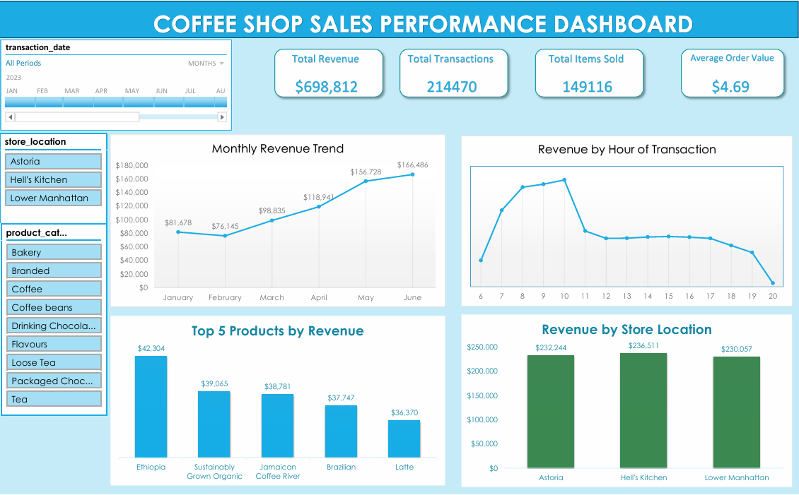

# ☕ Dashboard Analisis Penjualan Coffee Shop (Excel)

---

## 📋 Ringkasan Proyek
Proyek ini menyajikan analisis mendalam terhadap performa operasional dan penjualan Coffee Shop di tiga lokasi utama (Astoria, Hell's Kitchen, dan Lower Manhattan) untuk periode Januari hingga Juni 2023. Dengan mengolah lebih dari 214.000 data transaksi menggunakan Microsoft Excel, dashboard ini dirancang untuk mengidentifikasi tren pertumbuhan, pola perilaku pelanggan, serta memberikan strategi berbasis data untuk mengoptimalkan efisiensi bisnis.

---

## 🎯 Tujuan Bisnis
* **Analisis Tren:** Mengidentifikasi fluktuasi pendapatan bulanan untuk memitigasi risiko musiman.
* **Optimasi Operasional:** Menentukan jam sibuk (*peak hours*) untuk manajemen staf yang lebih efisien.
* **Strategi Produk:** Menentukan produk kontributor utama dan preferensi kategori pelanggan.
* **Benchmarking Geografis:** Membandingkan performa antar cabang untuk standarisasi layanan.

---

## 🔢 Indikator Kinerja Utama (KPI)
* **Total Pendapatan:** $698.812
* **Total Transaksi:** 214.470
* **Total Produk Terjual:** 149.116
* **Rata-rata Nilai Pesanan (AOV):** $4,69

---

## 💡 Insight Utama
* **Pemulihan Pendapatan:** Pendapatan dimulai pada level $81.678 di bulan Januari, sempat mengalami penurunan 8% di Februari ($76.145), dan memasuki fase pemulihan yang konsisten sejak Maret.
* **Pertumbuhan Kuat:** Bisnis bangkit kuat dari titik terendah Februari hingga mencapai $166.486 di bulan Juni—mencatat pertumbuhan kumulatif lebih dari 118% dalam empat bulan.
* **Puncak Jam Sibuk:** Transaksi sangat terkonsentrasi antara pukul 07:00–10:00 pagi, dengan puncak pada pukul 10:00 pagi, menandakan kopi sebagai kebutuhan utama saat berangkat kerja.
* **Produk Unggulan:** Produk **Ethiopia** ($42.304) dan **Sustainably Grown Organic** ($39.065) memimpin pendapatan, menunjukkan permintaan tinggi terhadap kopi spesialitas premium.
* **Lokasi Terunggul:** **Hell's Kitchen** ($236.511) unggul secara signifikan dibandingkan cabang Astoria dan Lower Manhattan.

---

## 🚀 Rekomendasi Strategis
* **Mitigasi Musiman:** Melakukan evaluasi mendalam terhadap penurunan di bulan Februari untuk menyusun strategi mitigasi di tahun berikutnya.
* **Kecepatan Layanan:** Menerapkan "Express Line" atau menambah staf barista pada jam sibuk pagi (07:00–10:00) untuk meningkatkan kepuasan pelanggan.
* **Program Non-Sibuk:** Meluncurkan promo "Lunch Break Combo" antara pukul 11:00–14:00 untuk mendorong transaksi di saat jam sepi setelah masa sibuk pagi.
* **Optimasi AOV:** Melakukan bundling kopi premium Ethiopia dengan peralatan seduh manual untuk mendorong AOV menuju target $5,00+.
* **Benchmarking Operasional:** Mereplikasi standar tata letak dan kecepatan layanan dari cabang Hell's Kitchen ke cabang lainnya.

---

## 🛠️ Detail Teknis

| **Aspek** | **Keterangan** |
| :--- | :--- |
| **Alat yang Digunakan** | Microsoft Excel, Power Query |
| **Tipe Visualisasi** | Line Chart, Clustered Column Chart, KPI Cards, Slicers |
| **Sumber Data** | Dataset Transaksi Penjualan Coffee Shop (2023) |
| **Pemodelan Data** | Pivot Tables & Agregasi Data Multi-Sumber |
| **Tujuan** | Menganalisis pola penjualan dan memberikan strategi pertumbuhan berbasis data |
| **File Proyek** | `coffee_shop_sales_dashboard.xlsx` |

---

## 🧠 Keahlian Analisis Data Excel yang Ditunjukkan
* **Pembersihan Data (Power Query):** Menangani nilai yang hilang, memformat tanggal, dan mengekstrak komponen jam untuk analisis pola harian.
* **Pemodelan Data:** Mengubah lebih dari 214.000 baris data mentah menjadi metrik bisnis yang bermakna menggunakan Pivot Tables.
* **Dashboard Interaktif:** Merancang visual interaktif dengan Slicer dan Timeline untuk eksplorasi data secara real-time.
* **Storytelling Data:** Menerjemahkan data transaksi yang kompleks menjadi narasi bisnis yang dapat ditindaklanjuti.

---

### 🏁 Penulis
**Dibuat oleh:** Agung Gustiawan  
⭐ *Jika proyek ini bermanfaat, berikan "Star" pada repositori ini!*
